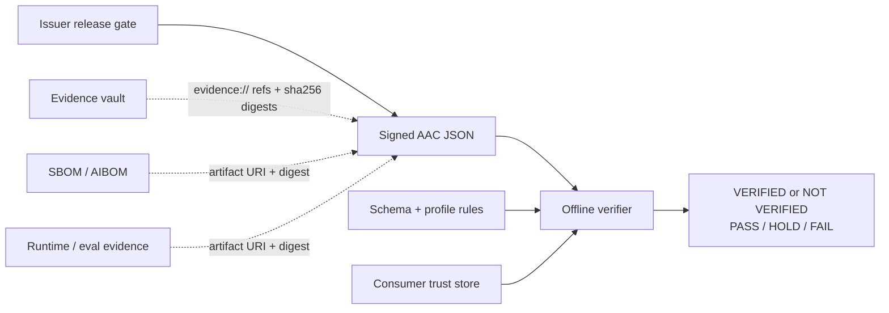

# AAC Overview

Agent Assurance Case (AAC) is a signed JSON evidence object for a single agentic AI release decision.

## What Exists Today

- Component inventory formats such as CycloneDX ML-BOM and SPDX AI describe what is in a system.
- Provenance systems such as in-toto, SLSA, and Sigstore describe how artifacts were built or signed.
- Runtime telemetry such as OpenTelemetry GenAI describes what happened during execution.
- Governance frameworks such as NIST AI RMF, ISO/IEC 42001, and the EU AI Act describe process obligations.

## Gap AAC Fills

AAC records what was checked for one release, what failed, what is held, what passed, which evidence artifacts are bound by digest, and who signed the resulting verdict. A verifier can recompute the verdict offline from the AAC plus a trusted public key.

AAC is the release-decision layer between inventory, provenance, telemetry, and governance records.

## What AAC Does Not Solve

- It does not prove detectors are semantically correct.
- It does not define key rotation, revocation, or issuer trust.
- It does not certify legal compliance.
- It does not replace SBOMs, AIBOMs, traces, provenance, or policy engines.
- It does not make unbound evidence-vault contents immutable.

## Trust Boundary

The verifier trusts the AAC bytes, the schema/profile rules it implements, and a public key supplied by the consumer's trust store. It does not trust `public_key_ref` merely because the AAC names it, and it does not fetch or reinterpret external evidence during verification.
