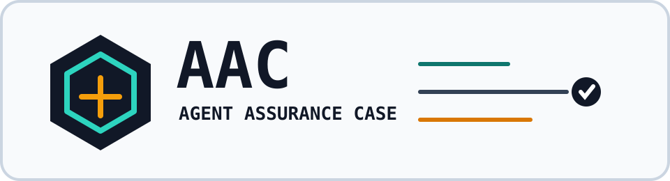

<div align="center">



# Agent Assurance Case

**A portable, signed, audit-grade evidence object for agentic AI release assurance.**

[](https://github.com/jlov7/agent-assurance-case/actions/workflows/ci.yml)
[](https://github.com/jlov7/agent-assurance-case/actions/workflows/release-fingerprints.yml)
[](https://scorecard.dev/viewer/?uri=github.com/jlov7/agent-assurance-case)
[](https://doi.org/10.5281/zenodo.20379393)


[DOI: 10.5281/zenodo.20379393](https://doi.org/10.5281/zenodo.20379393) · [Release: v0.2-candidate.7](https://github.com/jlov7/agent-assurance-case/releases/tag/v0.2-candidate.7) · [Release fingerprints](RELEASE_FINGERPRINTS.md)

</div>

Agent Assurance Case (AAC) is a draft specification and reference verifier for one release-critical question:

> Can this agentic AI workflow be released, and can an auditor verify the evidence offline?

An AAC is a JSON object that binds inventory, detector coverage, findings, policy decisions, release conditions, compliance evidence candidates, a deterministic verdict, and an Ed25519 signature. A verifier recomputes the verdict without network calls, without an LLM, and without trusting the issuer's declared result.

## Why It Exists

Agentic systems are assembled from workflows, tools, skills, prompts, memory stores, models, datasets, credentials, policies, and runtime environments. Existing standards cover important adjacent layers: SBOMs and AI BOMs enumerate components, provenance frameworks describe how artifacts were built, and governance frameworks describe organizational obligations.

AAC fills the release-decision gap: a small, portable assurance record that says what was checked, what failed, what is held, what passed, who signed it, and whether the evidence still verifies.

AAC is not a legal compliance certification. It is a signed evidence object that can support release review, audit preparation, and independent verification.

Read [OVERVIEW.md](OVERVIEW.md) first for the one-page model and trust boundary. Read [THREAT_MODEL.md](THREAT_MODEL.md), [LIMITATIONS.md](LIMITATIONS.md), [REVIEW_GUIDE.md](REVIEW_GUIDE.md), [IMPLEMENTATION_GUIDE.md](IMPLEMENTATION_GUIDE.md), [RELEASE_FINGERPRINTS.md](RELEASE_FINGERPRINTS.md), [SECURITY_POSTURE.md](SECURITY_POSTURE.md), [`security-insights.yml`](security-insights.yml), and [`repository-posture.json`](repository-posture.json) before relying on AAC in a release process.

## Quick Start

Verify the bundled examples with the demo key:

```bash
pip install -r verifier/requirements.txt
python verifier/verify.py examples/pass-with-coverage.json --allow-demo-key
python verifier/verify.py examples/skill-poisoning-hold.json --allow-demo-key
python verifier/verify.py examples/critical-exfiltration-fail.json --allow-demo-key
```

Expected final line for each command:

```text
VERIFIED
```

`--allow-demo-key` is only for the bundled examples. It is not a production trust mode. The demo public key is published at `keys/demo-issuer-v0.2.pub` so reviewers can inspect the exact key used by the examples.

Verify a production case with an issuer key:

```bash
python verifier/verify.py case.json --public-key issuer.pub
```

Run the conformance tests:

```bash
pip install -r verifier/requirements-dev.txt
python -m pytest tests/ -q
```

Run the publication gate:

```bash
./VERIFY-PUBLICATION-READY.sh
```

Verify the published release fingerprint from current `main`:

```bash
python3 scripts/verify_release_fingerprints.py
```

## What The Verifier Checks

- JSON Schema conformance with format checks enabled.
- Duplicate JSON object keys, `NaN`, `Infinity`, floats, and unsafe integers are rejected.
- All timestamps must be UTC RFC 3339 strings ending in `Z`.
- `evidence.content_hash` is recomputed over the signed payload.
- `evidence.signature` is verified with Ed25519.
- Canonicalization behavior is pinned by published byte-level test vectors.
- Sign/verify behavior is pinned by a published golden vector.
- Unsupported profiles return `NOT VERIFIED`.
- PASS/HOLD/FAIL is recomputed deterministically from the case contents.
- A verifier never silently skips signature verification.

## Repository Layout

```text
.
├── README.md
├── OVERVIEW.md
├── SPEC.md
├── THREAT_MODEL.md
├── LIMITATIONS.md
├── REVIEW_GUIDE.md
├── IMPLEMENTATION_GUIDE.md
├── RELEASE_FINGERPRINTS.md
├── SECURITY_POSTURE.md
├── EXTERNAL_REVIEW_LEDGER.md
├── CITATION.cff
├── CHANGELOG.md
├── PUBLICATION.md
├── assets/
│   └── aac-logo.svg
├── keys/
│   └── demo-issuer-v0.2.pub
├── schemas/
│   └── agent-assurance-case-v0.2.schema.json
├── scripts/
│   └── verify_release_fingerprints.py
├── profiles/
│   ├── aac.core.md
│   ├── runwright.skills.release.md
│   └── runwright.mcp.release.md
├── examples/
│   ├── pass-with-coverage.json
│   ├── skill-poisoning-hold.json
│   └── critical-exfiltration-fail.json
├── test-vectors/
│   ├── canonicalization-v0.2.json
│   └── sign-verify-v0.2.json
├── verifier/
│   ├── verify.py
│   ├── requirements.txt
│   └── requirements-dev.txt
└── tests/
    └── test_verifier.py
```

## Profiles

The schema defines shape. A profile defines the evidence bar.

`aac.core` is the portable baseline. It is the part intended to stand independently of any one product, vendor, or implementation.

`runwright.skills.release` and `runwright.mcp.release` are vendor profiles included as reference examples. They build on `aac.core`; they do not define AAC itself and they may not relax the core rules. Other organizations can define their own profiles for their own assurance surfaces.

This separation is deliberate: AAC can be cited, implemented, archived, and discussed as a standalone assurance format even if Runwright evolves separately or is built by someone else.

## Status

Current draft: `v0.2-candidate.7`.

The draft schema identifier is pinned to the candidate tag:

```text
https://raw.githubusercontent.com/jlov7/agent-assurance-case/v0.2-candidate.7/schemas/agent-assurance-case-v0.2.schema.json
```

This draft supersedes an unpublished v0.1 design that had trust-critical defects around signature verification and evidence metadata binding. Those bug classes now have regression tests.

Do not claim AAC v1.0 conformance yet. This repository is open for implementation feedback on:

- verdict semantics;
- evidence binding and canonicalization;
- profile boundaries;
- privacy posture for external evidence artifacts;
- compatibility with audit and release-review workflows.

Current public review thread: [RFC: external review for AAC v0.2-candidate.7](https://github.com/jlov7/agent-assurance-case/issues/2). Current external review status: no accepted independent review yet; see [EXTERNAL_REVIEW_LEDGER.md](EXTERNAL_REVIEW_LEDGER.md). Reviewers can start with the 10-minute and 30-minute recipes in [REVIEW_GUIDE.md](REVIEW_GUIDE.md#review-recipes). Ledger candidates can use the machine-checkable [`review-report-template.json`](review-report-template.json) described in [REVIEW_GUIDE.md](REVIEW_GUIDE.md#structured-review-reports). Independent verifier/parser authors can use the [implementation report issue form](https://github.com/jlov7/agent-assurance-case/issues/new?template=implementation-report.yml).

## Standards Alignment

AAC is designed to sit beside, not replace:

- CycloneDX ML-BOM and SPDX AI profiles for component inventory;
- OpenTelemetry GenAI conventions for runtime evidence;
- Sigstore, in-toto, and SLSA for provenance;
- NIST AI RMF, ISO/IEC 42001, and EU AI Act documentation workflows;
- W3C Verifiable Credentials for future portability wrappers.

## Citation

This repository includes `CITATION.cff` and `codemeta.json` so GitHub, archives, and software metadata indexers can generate citations and discovery metadata.

The v0.2-candidate.7 release is archived at [10.5281/zenodo.20379393](https://doi.org/10.5281/zenodo.20379393). The superseded v0.2-candidate.6 archive remains available at [10.5281/zenodo.20345018](https://doi.org/10.5281/zenodo.20345018), and the superseded v0.2-candidate.5 archive remains available at [10.5281/zenodo.20185170](https://doi.org/10.5281/zenodo.20185170). To list the work on an ORCID record, add the final version DOI as a work item through ORCID. See `PUBLICATION.md` for the release checklist.

## Contributing

Issues and pull requests are welcome while the draft is under review. Please keep proposals scoped, include a concrete example, and explain how the change affects deterministic verification. For broad external review, use the current [AAC v0.2-candidate.7 RFC thread](https://github.com/jlov7/agent-assurance-case/issues/2), start from the [review recipes](REVIEW_GUIDE.md#review-recipes), or submit a structured review report through the external review issue form.

Specification text, profiles, examples, and documentation are licensed under CC BY 4.0. Code, schemas, keys, tests, and CI are licensed under Apache 2.0.

Security-sensitive reports should follow `SECURITY.md`.

Threat model assumptions are summarized in `THREAT_MODEL.md`.

## Independence Notice

This is personal, independent work by Jason Mark Lovell. It is not authored, sponsored, endorsed, or reviewed by, and does not represent the views of, any employer, client, or affiliated organization.
